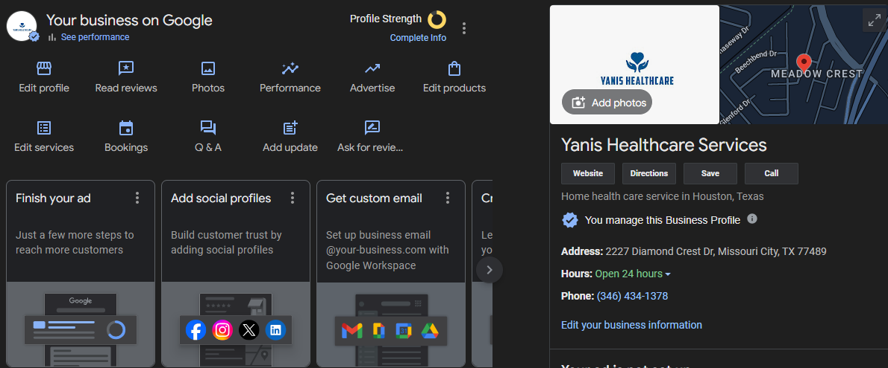
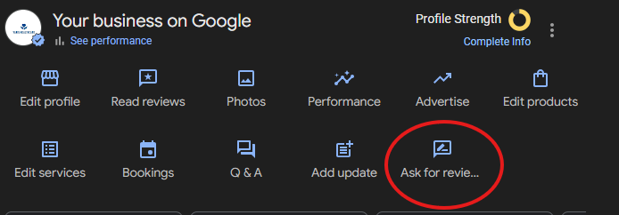

We will be making use of YANIS healthcare services as an example for this tutorial on how to create a google business page.
### Step 1: 
>Go to **google maps** - [Google Maps](https://www.google.com/maps). 

### Step 2: 
> Click on the burger menu icon at the top left corner.

### Step 3:
> Navigate through the menu and select, "**Add your business&**."

### Step 4:
> Complete information entry: *address, name, contact details, and hours of business*.

### Step5:
>Wait for google to verify business ownership.

### Step6:
>Ask friends and family for review.

>This provides sharable link for your website or chat group.
