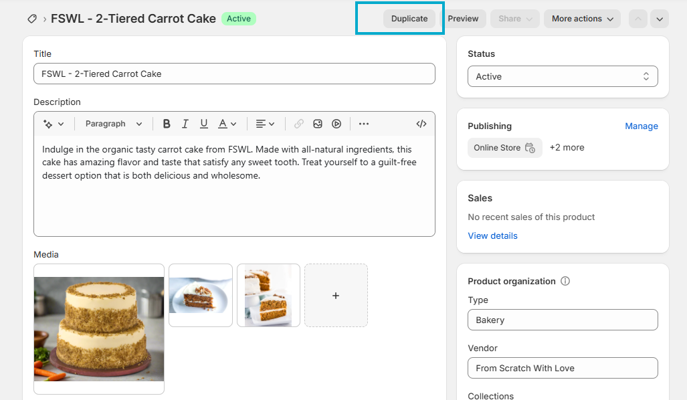

## Shopify Tutorial

### Service Plan

1. Free Trial - $1/Month.

2. Select your theme - Visit Theme Store. One that fits your business plan/design.

3. After the theme selection you are taken to the shopify page editor. To be specific the Home page/Landing page.

### Page design

**Header** - Announcement bar, Header.

  1. Click and select your images.
  2. Edit and add new section. Such image with text and other options.

**Images** - You can upload your images or explore free options from shopify.

**Text** - AI Generate text feature. Describe what the item or product you want to post.

### Add Products

**Dashboard - Products**

Depending on the type of products you are sale the different options may apply to you. These includes the following

**Title.**

**Description.**

**Images, video, and 3D models.**

**Price.**

**Weight.**

**Inventory.**

**Variant - Color, size, and others.**

### Creating a collection

1. Give your Collection a title - Favorites.

2. Collection type - Manual (This allows you select your products).

3. Automatic will be for options like - Most viewed, most purchased, and so on.

4. Select products for the collection - Options will be made available from the list of product you have created in the products section.

5. You can add your collection to your pages and adjust content based on availability. This refers to number of items per line.

### Media AI Editor

1. Using the AI editor icon - enhance background you can remove the background.
2. You can describe was you want the background to be and it will be generated.

### Creating new pages

1. Online store - Add page.
2. Give new page a title.
3. Add text or/and image to new page.
4. Save edit.
5. Create page template to associate with new page.

### Add New Page To Menu

1. Navigation Menu - Click on Main menu - Add menu item.
2. Give new menu item a name.
3. select the page from the search options - This should be under pages.

### Creating policies in the footer

1. Go to settings.
2. policies.
3. Insert shopify template and review documents before adding.

### Footer Menu

1. Add menu item.
2. Add policies to footer menu and save.

### Activating payments

1. Go to settings and navigate to payments.
2. Click on complete account set up.
3. Shopify payment is recommended.
4. You can customize the client's checkout experience.

### Shipping and delivery

You have shipping discounts with the shopify plan.

### Tax Information

1. Settings.
2. Taxes and duties.
3. Select your country of origin.

### Choosing a domain

1. Settings.
2. Domains.
3. You can either buy a new domain or connect an existing domain.
4. Buy the domain for your business.

### Pick a plan

1. The basic plan should work and you can upgrade to any other plan as required.

2. Monthly payment option.

3. Once you have picked your plan and you are ready to open your store. Click remove store password to allow users access to your store.
